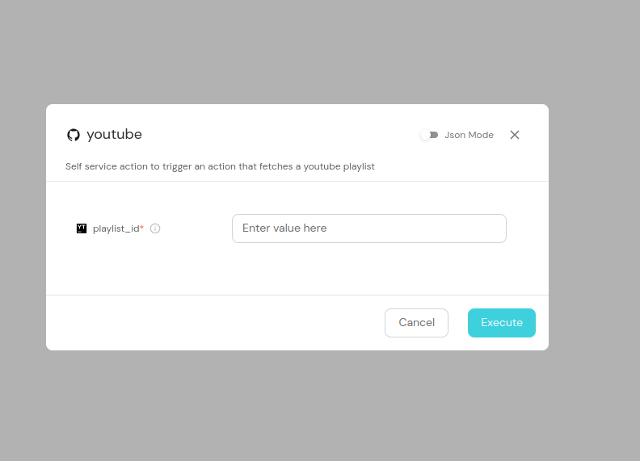
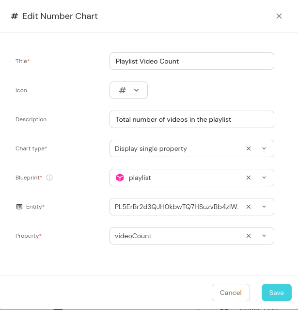
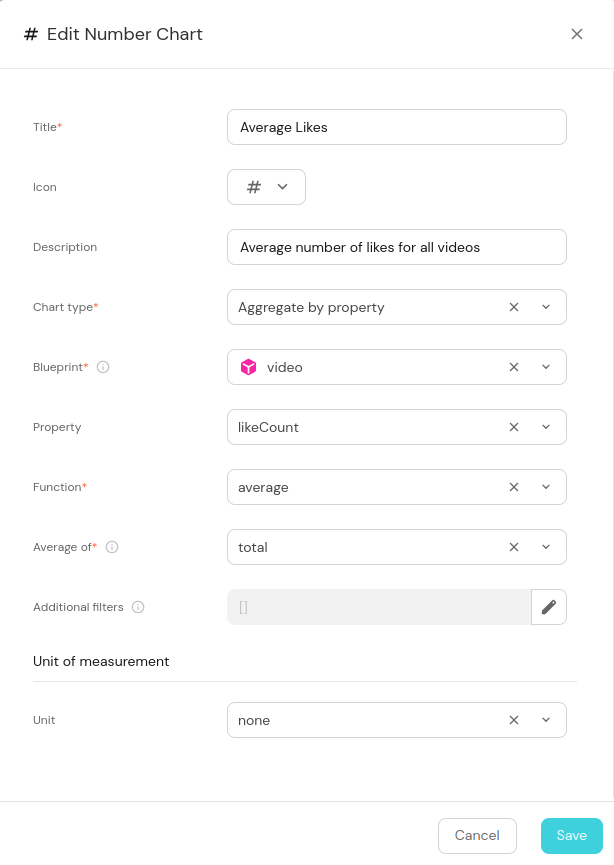
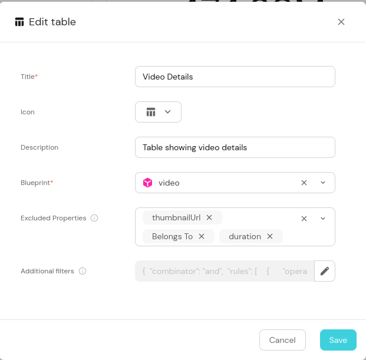
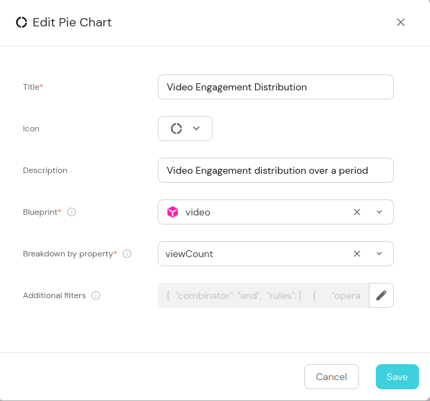
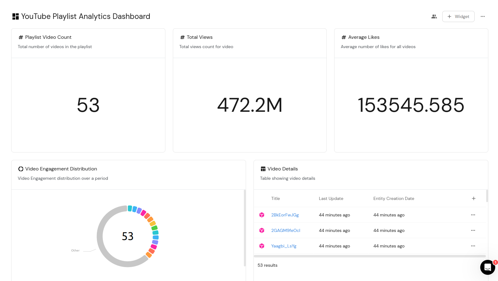

# YouTube Playlist & Videos catalog in Port

A comprehensive guide for creating YouTube playlist & Videos catalog in Port, including data modeling, ingestion, and visualization.

## Overview

This guide shows you how to set up a system for tracking YouTube playlists and video performance in Port. 
You’ll learn how to organize your YouTube content, automate the tracking of video metrics, and create visualizations  to monitor playlist growth and audience engagement.

## Prerequisites

Before starting this integration, ensure you have:
   1. Signed up and Logged into your Port account [app.getport.io](https://app.getport.io)
   2. Installed Port's Github app by clicking [here](https://github.com/apps/getport-io/installations/new)
   3. Obtained a YouTube Data API v3 key via the [Google Cloud Console](https://console.cloud.google.com)
   4. Prepared your Port organization's Client ID and Client Secret. To find you Port credentials, click [here](https://docs.getport.io/build-your-software-catalog/custom-integration/api/#find-your-port-credentials).

## Data Modeling in Port
This section outlines the data model for managing YouTube content in Port. The model consists of two main blueprints: `playlist` and `video`, designed to track YouTube playlists and their associated videos. The relationship between playlists and videos is maintained through a one-to-many relationship, where each video belongs to a playlist.

### Setting up Blueprints
   1. Log into Port
   2. Click ["Builder"](https://app.getport.io/settings/data-model) in the left sidebar
   3. Click "+ New Blueprint"
   4. In the model that pops up, click on "{---} Edit JSON"
   5. Copy the **JSON** snippet below to create the **Playlist** and **Video** blueprint


<details>
<summary><b>Playlist blueprint (click to expand)</b></summary>

```json
{
  "identifier": "playlist",
  "description": "Youtube playlist description",
  "title": "YouTube Playlist",
  "icon": "Youtrack",
  "schema": {
    "properties": {
      "description": {
        "type": "string",
        "title": "description",
        "description": "the description of the playlist"
      },
      "thumbnail_url": {
        "type": "string",
        "title": "thumbnailUrl",
        "description": "the URL of the playlist's thumbnail image",
        "format": "url"
      },
      "video_count": {
        "type": "number",
        "title": "videoCount",
        "description": "The number of videos in the playlist"
      }
    },
  },
  "mirrorProperties": {},
  "calculationProperties": {},
  "aggregationProperties": {},
  "relations": {}
}
```

</details>


<details>
<summary><b> Video blueprint (click to expand) </b></summary>

```json
{
  "identifier": "video",
  "description": "youtube video blueprint",
  "title": "YouTube Video",
  "icon": "Youtrack",
  "schema": {
    "properties": {
      "description": {
        "type": "string",
        "title": "description",
        "description": "the description of the video"
      },
      "thumbnail_url": {
        "type": "string",
        "title": "thumbnailUrl",
        "description": "The URL of the video's thumbnail image",
        "format": "url"
      },
      "duration": {
        "type": "string",
        "title": "duration",
        "description": "the duration of the video"
      },
      "view_count": {
        "type": "number",
        "title": "viewCount",
        "description": "The number of views the video has received"
      },
      "like_count": {
        "type": "number",
        "title": "likeCount",
        "description": "The number of likes the video has received"
      },
      "comment_count": {
        "type": "number",
        "title": "commentCount",
        "description": "The number of comments the video has received"
      }
    },
  },
  "mirrorProperties": {},
  "calculationProperties": {},
  "aggregationProperties": {},
  "relations": {
    "belongs_to": {
      "title": "playlist",
      "description": "relationship between video and playlist",
      "target": "playlist",
      "required": false,
      "many": false
    }
  }
}
```

</details>

## Self service setup
- This self-service automates the process of importing YouTube playlists into your catalog, allowing users to easily add and track video content without requiring    direct access to the backend systems or API credentials.
  1. Navigate to Self-service in Port by clicking [here](https://app.getport.io/self-serve)
  2. Click on the "+ Action" button to create and new action.
  3. Click on "{---} Edit JSON" in the pop up
  4. Copy and paste the json configuration details below to setup the Self-Service.
  > **💡 Tip**
> 
> Remember to replace:
> - <YOUR_ORGANISATION_NAME> with your organization name
> - <YOUR_REPO_NAME> with your repository name
> - <SPECIFY_WORKFLOW_FILE> with the name of the workflow

  <details>
  <summary><b> Action configuration (click to expand) </b></summary>

  ```json
  {
  "identifier": "youtube",
  "title": "Ingest Playlist from YouTube",
  "icon": "Github",
  "description": "Self service action to trigger an action that fetches a youtube playlist",
  "trigger": {
    "type": "self-service",
    "operation": "CREATE",
    "userInputs": {
      "properties": {
        "playlist_id": {
          "icon": "Youtrack",
          "type": "string",
          "title": "playlist_id",
          "description": "Playlist id to be used for fetching the different respective videos"
        }
      },
      "required": [
        "playlist_id"
      ],
      "order": [
        "playlist_id"
      ]
    },
    "blueprintIdentifier": "playlist"
  },
  "invocationMethod": {
    "type": "GITHUB",
    "org": "<YOUR_ORGANISATION_NAME>",
    "repo": "<YOUR_REPO_NAME>",
    "workflow": "<SPECIFY_WORKFLOW_FILE>",
    "workflowInputs": {
      "{{ spreadValue() }}": "{{ .inputs }}",
      "port_context": {
        "runId": "{{ .run.id }}",
        "blueprint": "{{ .action.blueprint }}"
      }
    },
    "reportWorkflowStatus": true
  },
  "requiredApproval": false
}

  ```

  </details>

## GitHub workflow
  - A GitHub workflow is essential for this YouTube playlist integration because it provides an automated, secure, and scalable method for ingesting data. It allows  safe management of sensitive API credentials through GitHub Secrets, enables programmatic fetching of playlist and video details from YouTube, and creates a standardized process for importing content into Port

   1. Go to your GitHub repository settings
   2. Add each of these secrets:
     
    - YOUTUBE_API_KEY (Your YouTube Data API key)
    - PORT_API_KEY (Your Port API key)
    - PORT_CLIENT_ID (Your Port Client ID)
    - PORT_CLIENT_SECRET (Your Port Client Secret)
     
   3. Create a new file `.github/workflows/ingest.yml`. The `ingest.yml` is the file that handles the logic of pulling of data from youtube
   4. Add the following GitHub workflow configuration:

<details>
<summary><b> GitHub Workflow (click to expand) </b></summary>

  ```yaml
  name: Ingest YouTube Playlist

  on:
    workflow_dispatch:
      inputs:
        playlist_id:
          description: "Youtube video playlist id"
          required: true
        port_context:
          description: "The port context"
          type: string
          required: true

  jobs:
    create-playlist:
      runs-on: ubuntu-latest
      outputs:
        playlist_title: ${{ steps.playlist_info.outputs.title }}
        playlist_count: ${{ steps.playlist_info.outputs.count }}
      steps:
        - name: Get Port Token
          id: get_token
          env:
            PORT_CLIENT_ID: ${{ secrets.PORT_CLIENT_ID }}
            PORT_CLIENT_SECRET: ${{ secrets.PORT_CLIENT_SECRET }}
          run: |
            set -e
            TOKEN_RESPONSE=$(curl -s -X POST "https://api.getport.io/v1/auth/access_token" \
              -H "Content-Type: application/json" \
              -d "{\"clientId\": \"$PORT_CLIENT_ID\", \"clientSecret\": \"$PORT_CLIENT_SECRET\"}")
            
            ACCESS_TOKEN=$(echo "$TOKEN_RESPONSE" | jq -r '.accessToken')
            if [ -z "$ACCESS_TOKEN" ] || [ "$ACCESS_TOKEN" = "null" ]; then
              echo "::error::Failed to get access token"
              exit 1
            fi
            echo "ACCESS_TOKEN=$ACCESS_TOKEN" >> $GITHUB_ENV

        - name: Get Playlist Info and Create Port Entity
          id: playlist_info
          env:
            YOUTUBE_API_KEY: ${{ secrets.YOUTUBE_API_KEY }}
            PLAYLIST_ID: ${{ github.event.inputs.playlist_id }}
            PORT_CONTEXT: ${{ inputs.port_context }}
          run: |
            set -e
            echo "::group::Fetching playlist data"
            PLAYLIST_DATA=$(curl -s "https://youtube.googleapis.com/youtube/v3/playlists?part=snippet,contentDetails&id=${PLAYLIST_ID}&key=${YOUTUBE_API_KEY}")
            
            if [ "$(echo $PLAYLIST_DATA | jq '.items | length')" -eq 0 ]; then
              echo "::error::No playlist found"
              exit 1
            fi

            TITLE=$(echo $PLAYLIST_DATA | jq -r '.items[0].snippet.title')
            DESC=$(echo $PLAYLIST_DATA | jq -r '.items[0].snippet.description')
            THUMB=$(echo $PLAYLIST_DATA | jq -r '.items[0].snippet.thumbnails.default.url')
            COUNT=$(echo $PLAYLIST_DATA | jq -r '.items[0].contentDetails.itemCount')

            PLAYLIST_PAYLOAD=$(jq -n \
              --arg id "$PLAYLIST_ID" \
              --arg title "$TITLE" \
              --arg desc "$DESC" \
              --arg thumb "$THUMB" \
              --arg count "$COUNT" \
              '{
                identifier: $id,
                properties: {
                  description: $desc,
                  thumbnail_url: $thumb,
                  video_count: ($count|tonumber)
                }
              }')

            echo "::group::Creating playlist entity"
            RESPONSE=$(curl -s -X POST "https://api.getport.io/v1/blueprints/playlist/entities" \
              -H "Authorization: Bearer $ACCESS_TOKEN" \
              -H "Content-Type: application/json" \
              -d "$PLAYLIST_PAYLOAD")

            if [ "$(echo "$RESPONSE" | jq -r '.ok // false')" != "true" ]; then
              echo "::error::Failed to create playlist entity: $(echo "$RESPONSE" | jq -r '.message')"
              exit 1
            fi
            echo "::endgroup::"

            echo "title=$(echo "$TITLE" | jq -R -s .)" >> $GITHUB_OUTPUT
            echo "count=$COUNT" >> $GITHUB_OUTPUT

    process-videos:
      needs: create-playlist
      runs-on: ubuntu-latest
      steps:
        - name: Get Port Token
          id: get_token
          env:
            PORT_CLIENT_ID: ${{ secrets.PORT_CLIENT_ID }}
            PORT_CLIENT_SECRET: ${{ secrets.PORT_CLIENT_SECRET }}
          run: |
            set -e
            TOKEN_RESPONSE=$(curl -s -X POST "https://api.getport.io/v1/auth/access_token" \
              -H "Content-Type: application/json" \
              -d "{\"clientId\": \"$PORT_CLIENT_ID\", \"clientSecret\": \"$PORT_CLIENT_SECRET\"}")
            
            ACCESS_TOKEN=$(echo "$TOKEN_RESPONSE" | jq -r '.accessToken')
            if [ -z "$ACCESS_TOKEN" ] || [ "$ACCESS_TOKEN" = "null" ]; then
              echo "::error::Failed to get access token"
              exit 1
            fi
            echo "ACCESS_TOKEN=$ACCESS_TOKEN" >> $GITHUB_ENV

        - name: Process Videos
          env:
            YOUTUBE_API_KEY: ${{ secrets.YOUTUBE_API_KEY }}
            PLAYLIST_ID: ${{ github.event.inputs.playlist_id }}
            PORT_CONTEXT: ${{ inputs.port_context }}
            PLAYLIST_TITLE: ${{ needs.create-playlist.outputs.playlist_title }}
          run: |
            set -e
            # Extract run ID
            RUN_ID=$(echo "$PORT_CONTEXT" | jq -r --raw-input 'fromjson | .runId')
            if [ -z "$RUN_ID" ]; then
              echo "::error::Failed to get run ID from context"
              exit 1
            fi

            # Initialize counters in a temp file for persistence across subshells
            echo "0" > /tmp/videos_processed
            echo "0" > /tmp/videos_failed

            # Function to add logs to the action run
            add_action_log() {
              local MESSAGE=$1
              local STATUS_LABEL=${2:-""}

              # Send log without checking status
              local PAYLOAD="{\"message\": \"$MESSAGE\""
              if [ -n "$STATUS_LABEL" ]; then
                PAYLOAD="$PAYLOAD, \"statusLabel\": \"$STATUS_LABEL\""
              fi
              PAYLOAD="$PAYLOAD}"

              curl -s -X POST "https://api.getport.io/v1/actions/runs/$RUN_ID/logs" \
                -H "Authorization: Bearer $ACCESS_TOKEN" \
                -H "Content-Type: application/json" \
                -d "$PAYLOAD"
            }

            # Function to update final action status only
            update_final_status() {
              local STATUS=$1
              local SUMMARY=$2
              local DETAILS=$3

              curl -s -X PATCH "https://api.getport.io/v1/actions/runs/$RUN_ID" \
                -H "Authorization: Bearer $ACCESS_TOKEN" \
                -H "Content-Type: application/json" \
                -d "{
                  \"status\": \"$STATUS\",
                  \"message\": {
                    \"summary\": \"$SUMMARY\",
                    \"details\": \"$DETAILS\"
                  }
                }"
            }

            # Function to create video entity
            create_port_entity() {
              local BLUEPRINT=$1
              local PAYLOAD=$2
              curl -s -X POST "https://api.getport.io/v1/blueprints/${BLUEPRINT}/entities" \
                -H "Authorization: Bearer $ACCESS_TOKEN" \
                -H "Content-Type: application/json" \
                -d "$PAYLOAD"
            }

            # Function to process videos
            process_videos() {
              local PAGE_TOKEN=$1
              local API_URL="https://youtube.googleapis.com/youtube/v3/playlistItems?part=contentDetails&maxResults=50&playlistId=${PLAYLIST_ID}&key=${YOUTUBE_API_KEY}"
              if [ -n "${PAGE_TOKEN}" ]; then
                API_URL="${API_URL}&pageToken=${PAGE_TOKEN}"
              fi

              add_action_log "Fetching videos from playlist..." "Fetching"
              local ITEMS_RESPONSE=$(curl -s "${API_URL}")
              
              echo "$ITEMS_RESPONSE" | jq -r '.items[].contentDetails.videoId' | while read -r VIDEO_ID; do
                add_action_log "Processing video: ${VIDEO_ID}" "Processing"
                
                VIDEO_DATA=$(curl -s "https://youtube.googleapis.com/youtube/v3/videos?part=snippet,contentDetails,statistics&id=${VIDEO_ID}&key=${YOUTUBE_API_KEY}")
                
                if [ "$(echo "$VIDEO_DATA" | jq '.items | length')" -gt 0 ]; then
                  local V_TITLE=$(echo "$VIDEO_DATA" | jq -r '.items[0].snippet.title')
                  local V_DESC=$(echo "$VIDEO_DATA" | jq -r '.items[0].snippet.description')
                  local V_THUMB=$(echo "$VIDEO_DATA" | jq -r '.items[0].snippet.thumbnails.default.url')
                  local V_DURATION=$(echo "$VIDEO_DATA" | jq -r '.items[0].contentDetails.duration')
                  local V_VIEWS=$(echo "$VIDEO_DATA" | jq -r '.items[0].statistics.viewCount // "0"')
                  local V_LIKES=$(echo "$VIDEO_DATA" | jq -r '.items[0].statistics.likeCount // "0"')
                  local V_COMMENTS=$(echo "$VIDEO_DATA" | jq -r '.items[0].statistics.commentCount // "0"')

                  add_action_log "Found video: $V_TITLE" "Found"

                  VIDEO_PAYLOAD=$(jq -n \
                    --arg id "$VIDEO_ID" \
                    --arg title "$V_TITLE" \
                    --arg desc "$V_DESC" \
                    --arg thumb "$V_THUMB" \
                    --arg duration "$V_DURATION" \
                    --arg views "$V_VIEWS" \
                    --arg likes "$V_LIKES" \
                    --arg comments "$V_COMMENTS" \
                    --arg playlist_id "$PLAYLIST_ID" \
                    '{
                      identifier: $id,
                      properties: {
                        description: $desc,
                        thumbnail_url: $thumb,
                        duration: $duration,
                        view_count: ($views|tonumber),
                        like_count: ($likes|tonumber),
                        comment_count: ($comments|tonumber)
                      },
                      relations: {
                        belongs_to: $playlist_id
                      }
                    }')

                  RESPONSE=$(create_port_entity "video" "$VIDEO_PAYLOAD")
                  if [ "$(echo "$RESPONSE" | jq -r '.ok // false')" = "true" ]; then
                    CURRENT=$(cat /tmp/videos_processed)
                    echo $((CURRENT + 1)) > /tmp/videos_processed
                    add_action_log "Successfully processed video: $V_TITLE" "Success"
                  else
                    CURRENT=$(cat /tmp/videos_failed)
                    echo $((CURRENT + 1)) > /tmp/videos_failed
                    add_action_log "Failed to process video: $(echo "$RESPONSE" | jq -r '.message')" "Failed"
                  fi

                  # Progress update without status change
                  PROCESSED=$(cat /tmp/videos_processed)
                  FAILED=$(cat /tmp/videos_failed)
                  if [ $((PROCESSED % 5)) -eq 0 ]; then
                    add_action_log "Progress: Processed ${PROCESSED} videos, ${FAILED} failed" "Progress"
                  fi

                  sleep 1
                else
                  CURRENT=$(cat /tmp/videos_failed)
                  echo $((CURRENT + 1)) > /tmp/videos_failed
                  add_action_log "No data found for video: $VIDEO_ID" "Not Found"
                fi
              done

              # Check for next page
              NEXT_PAGE=$(echo "$ITEMS_RESPONSE" | jq -r '.nextPageToken // empty')
              if [ -n "$NEXT_PAGE" ]; then
                add_action_log "Fetching next page of videos..." "Next Page"
                process_videos "$NEXT_PAGE"
              fi
            }

            # Start processing
            add_action_log "Starting video processing for playlist: $PLAYLIST_TITLE" "Starting"
            process_videos ""

            # Final status update
            PROCESSED=$(cat /tmp/videos_processed)
            FAILED=$(cat /tmp/videos_failed)
            
            FINAL_DETAILS="Processed ${PROCESSED} videos, ${FAILED} failed"
            add_action_log "$FINAL_DETAILS" "Completed"
            
            if [ "$PROCESSED" -gt 0 ]; then
              update_final_status "SUCCESS" "Processing complete" "$FINAL_DETAILS"
            else
              update_final_status "FAILURE" "No videos processed" "$FINAL_DETAILS"
              exit 1
            fi

        - name: Report Failure
          if: failure()
          env:
            PORT_CONTEXT: ${{ inputs.port_context }}
          run: |
            set -e
            RUN_ID=$(echo "$PORT_CONTEXT" | jq -r --raw-input 'fromjson | .runId')
            
            curl -s -X PATCH "https://api.getport.io/v1/actions/runs/$RUN_ID" \
              -H "Authorization: Bearer $ACCESS_TOKEN" \
              -H "Content-Type: application/json" \
              -d '{
                "status": "FAILURE",
                "message": {
                  "summary": "Workflow failed",
                  "details": "Check logs for details"
                }
              }'

  ```

</details>

## Example self-service action
- On the Self-service tab, navigate to the self-service you created and click on "Create".
- The pop-up below will be shown, enter the value of the youtube `playlist_id` and click execute
<details>
<summary><b> Self-service execution (click to expand) </b></summary>

</details>
- This will trigger the workflow and you can track the progress from your Port account.
- When completed, go to catalog to view the playlist and videos respectively.


## Creating Visualizations

After the data is ingested, create these visualizations to monitor your YouTube content:

### 1. Video Count Metric
1. Navigate to "Dashboards" in Port
2. Click "+ Add Widget"
3. Select "Number Chart"
4. Configure the widget using the details on the image below:

<details>
<summary><b> Video count configuration (click to expand) </b></summary>

</details>

### 2. Average Likes Metric
1. Click "+ Add Widget"
2. Select "Number Chart"
3. Configure the widget using the details on the image below:

<details>
<summary><b> Average likes configuration (click to expand) </b></summary>

</details>

### 3. Video Details Table
1. Click "+ Add Widget"
2. Select "Table"
3. Configure the widget using the details on the image below:

<details>
<summary><b> Video details configuration (click to expand) </b></summary>

</details>

### 4. Engagement Distribution Pie Chart
1. Click "+ Add Widget"
2. Select "Pie Chart"
3. Configure the widget using the details on the image below:

<details>
<summary><b>Engagement distribution configuration (click to expand) </b></summary>

</details>

### YouTube Playlist Analytics Dashboard Layout
To create a dashboard, drag and organise the different widgets created above in a meaningful layout.

<details>
<summary>Example youtube analytics dashboard (click to expand) </summary>

</details>

## Conclusion

This guide has walked you through creating a comprehensive YouTube content catalog in Port. By implementing this integration, you have:

1. Automated playlist and video tracking through self-service actions
2. A structured data model for organizing YouTube content
3. Real-time metrics and analytics through customizable dashboards
4. Streamlined workflow for importing new playlists

You can now easily track your YouTube content performance, manage multiple playlists, and make data-driven decisions about your video strategy. To extend this integration, consider adding more metrics, creating additional visualizations, or customizing the dashboards to match your specific needs.